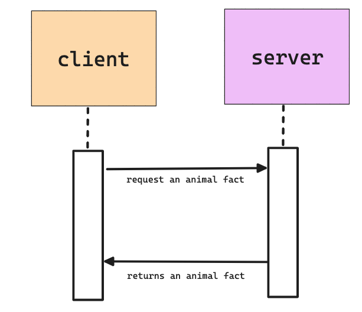

# Animal Fact Generator
A Flask microservice that provides random animal facts

## Table of Contents
- [About The Project](#about-the-project)
    - [Built With](#built-with)
- [Getting Started](#getting-started)
- [Prerequisites](#prerequisites)
- [Initial Setup](#initial-setup)
- [Running the App](#running-the-app)
- [How to Make a Request](#how-to-make-a-request)

## About The Project
This microservice provides random animal facts through a Flask API. It can be integrated into other websites to display fun and educational animal facts.

### Built With
[Python](https://www.python.org/)
[Flask](https://flask.palletsprojects.com/en/3.0.x/)

## Getting Started
To get a local copy running follow these steps

### Prerequisites
Python 3.10  
I suggest using [Pyenv](https://github.com/pyenv/pyenv) to manage Python installations but it is up to the user.

### Initial Setup
#### Done On First Setup

1. Clone the repo
   ```sh
   git clone https://github.com/github_olivia-cruz/animal-facts.git
   cd animal-facts
   ```
2. Create a virtual environment (only need to do once)
    ```sh
    python -m venv .venv
    ```
3. Start the virtual environment
    ```sh
    source .venv/bin/activate
    ```
4. Install the dependencies (only need to do once)
    ```sh
    pip install -r requirements.txt
    ```
5. Run the application
    ```sh
    python app.py
    ```

### Running the App
#### Used for subsequent runs
1. Start the virtual environment
    ```sh
    source .venv/bin/activate
    ```
2.  Run the application
    ```sh
    python app.py
    ```

## How to Make a Request

To request data from the Animal Fact Generator, use the following HTTP GET endpoints:
- `/facts` returns all animal facts.
- `/facts/random` returns a random fact.
- `/facts/<animal>` returns a specific fact.

Example call to fetch a random fact using curl:
```sh
curl http://localhost:5001/facts/random
```
The data from the microservice is returned in JSON format. Here's how you can handle the JSON response in Python:
```python
import requests
response = requests.get('http://localhost:5001/facts/random')
data = response.json()
print(data)  # Prints the random animal fact received
```


